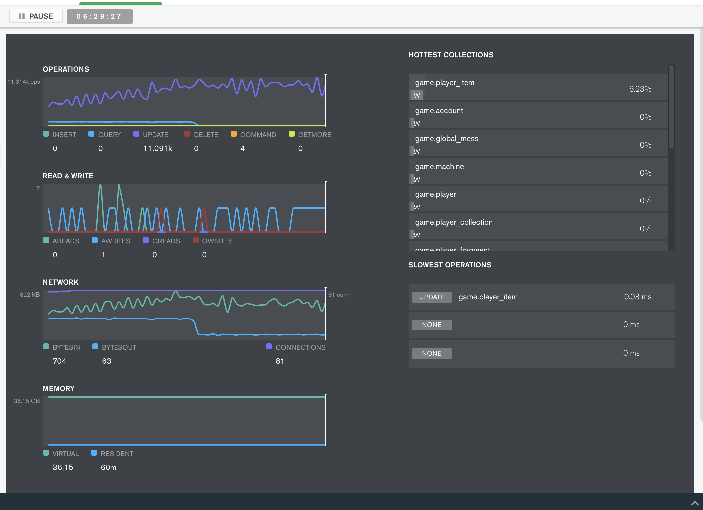
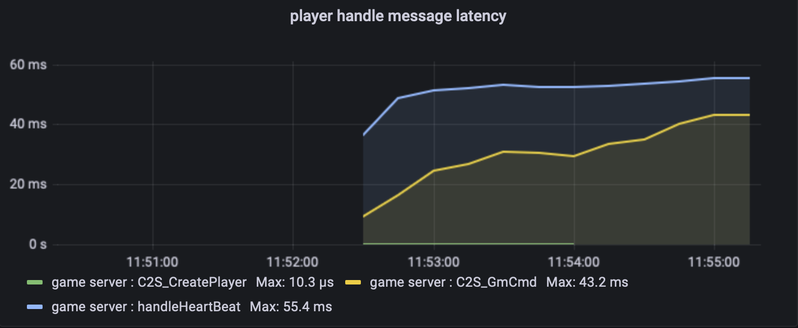

#

[](https://travis-ci.com/east-eden/server)
[](https://godoc.org/github.com/east-eden/server)
[](https://goreportcard.com/report/github.com/east-eden/server)

## Introduce

Server is a game server with horizontally-scalable and high-available. It was powered by [go-micro](https://github.com/micro/go-micro) and running in docker container. All services are disaster-tolerant and dynamically expandable.

- [简体中文手册](docs/manual.md)
- [organize graph](docs/organize_graph.md)
- [tcp protocol](docs/tcp_protocol.md)

## Requirement

- **MongoDB**
- **Consul** (in release)
- **Nsq** (in release)

## Benchmark

	Test device: macbook pro 16 2021 with Apple M1 Pro, 16G Mem
	Robots number: 6000
	Send message frequency: 2 messages per second 
	Save Mongodb frequency: 12k per second


* The machine cpu and memory usage are as follows:
	
	CPU usage: `15.16%` user, `30.77%` sys, `54.6%` idle

* The process occupies cpu and memory as follows: 

	| PID   | COMMAND     |  %CPU  |  MEM   | 
	| -- 	| --		  | --	   | --	    | 
	| 86643 | gate        |  111.1 |  619M+ | 
	| 86646 | game        |  80.9  |  751M+ | 
	| 86662 | client_bots |  71.3  |  679M+ | 
	| 1512  | mongod      |  30.6  |  160M  | 
	| 71456 | consul      |  1.9   |  53M-  | 
	| 71121 | nsqd        |  0.2   |  12M   | 
	| 86656 | mail        |  0.1   |  38M   |

* The MongoDB operations performance are as follows:

	

* The players' message processing latency are as follows:

	


## Getting Started

- **Download** - git clone this repo and cd in its root path

- **Start MongoDB** - running in `docker-compose`:

```shell
docker-compose run --service-ports -d mongo
```

- **Start Gate** - cd to `apps/gate`, run following command:

```shell
go run main.go
```

- **Start Game** - open another terminal session, cd to `apps/game`, run following command:

```shell
go run main.go
```

- **Start Combat** - open another terminal session, cd to `apps/combat`, run following command:

```shell
go run main.go
```

- **Start Client** - open another terminal session, cd to `apps/client`, run following command:

```shell
go run main.go
```

now you can communicate with server using (up down left right enter):


## License
server is MIT licensed.

