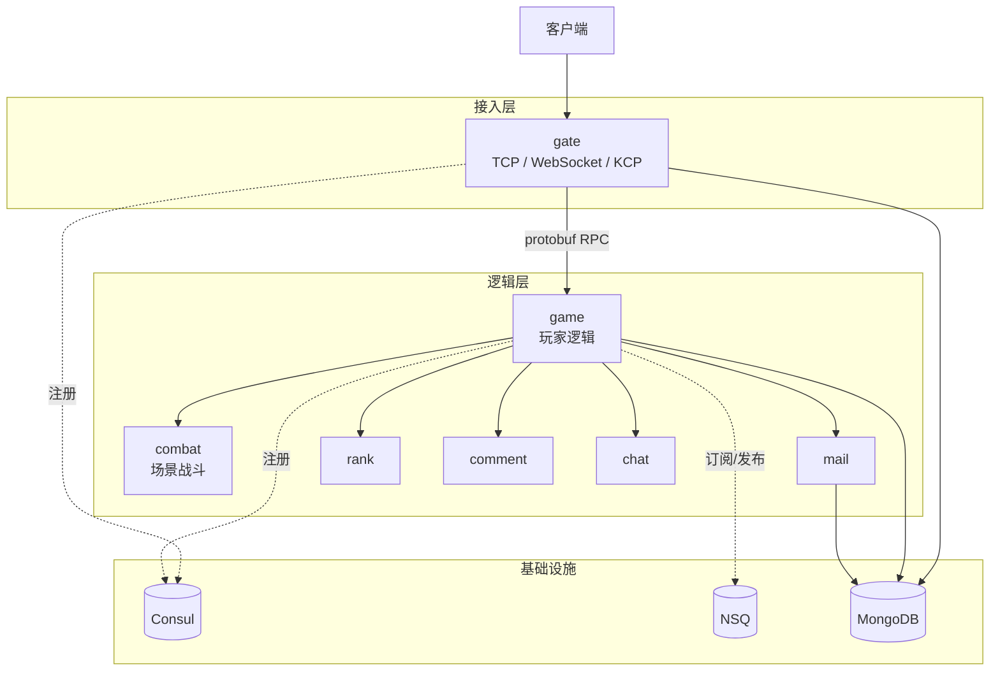
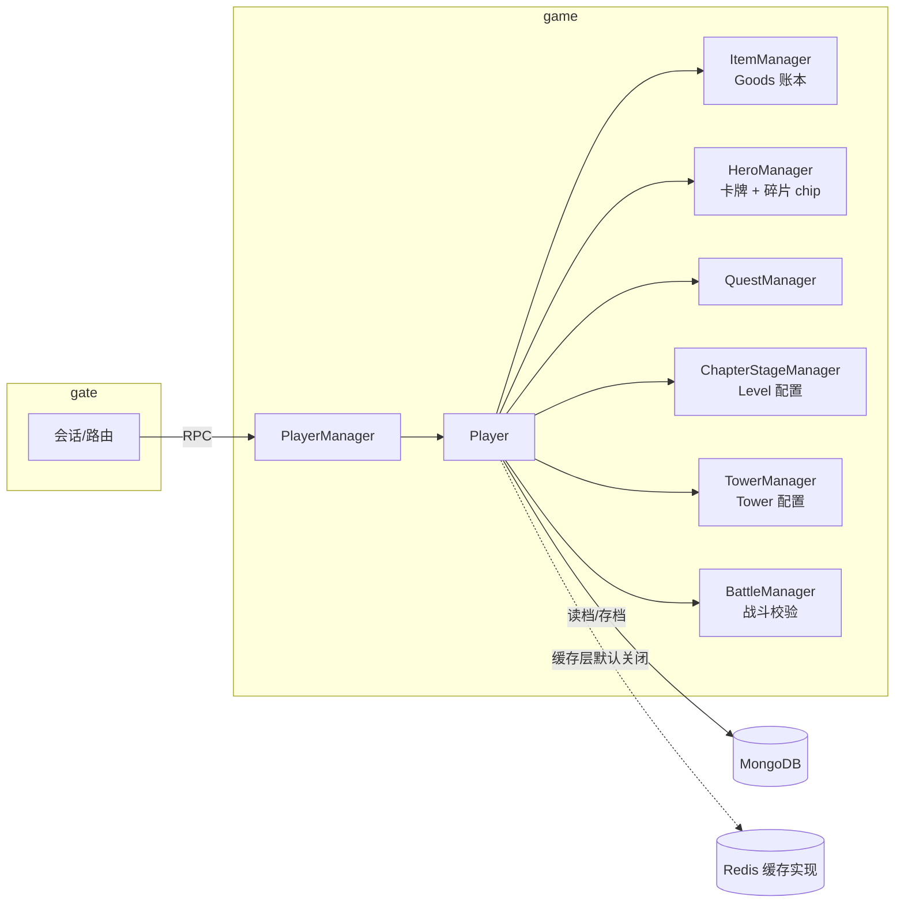
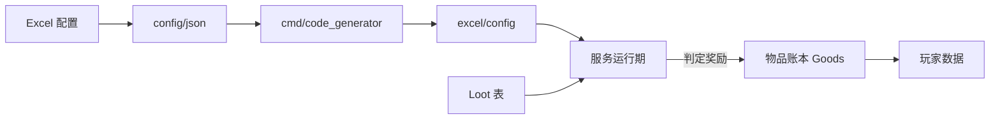
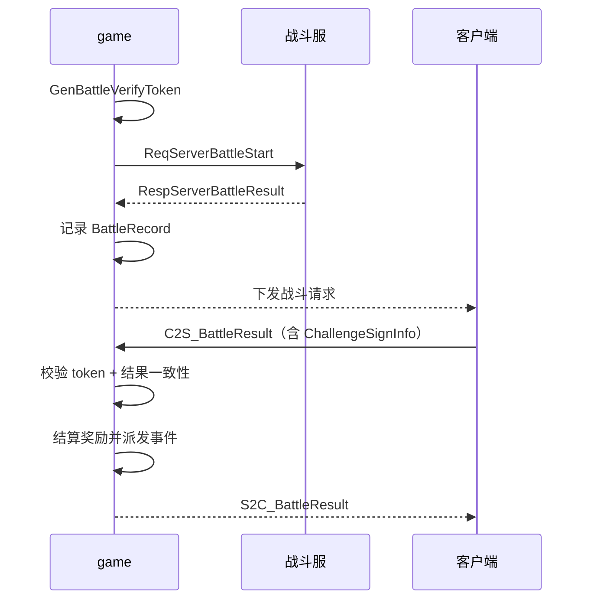

# 服务结构与数据流

## 微服务拓扑

```mermaid
graph TB
    subgraph 接入层
        Gate[gate<br/>TCP / WebSocket / KCP]
    end

    subgraph 逻辑层
        Game[game<br/>玩家逻辑]
        Combat[combat<br/>场景战斗]
        Mail[mail]
        Rank[rank]
        Comment[comment]
        Chat[chat]
    end

    subgraph 基础设施
        Consul[(Consul)]
        NSQ[(NSQ)]
        Mongo[(MongoDB)]
    end

    Client[客户端] --> Gate
    Gate -->|protobuf RPC| Game
    Game --> Combat
    Game --> Mail
    Game --> Rank
    Game --> Comment
    Game --> Chat

    Gate -.注册.-> Consul
    Game -.注册.-> Consul
    Game -. 订阅/发布 .-> NSQ

    Gate --> Mongo
    Game --> Mongo
    Mail --> Mongo

```

## gate、game 的 cache 与 database

```mermaid
graph LR
    subgraph gate
        GS[会话/路由]
    end

    subgraph game
        PM[PlayerManager]
        P[Player]
        P --> IM[ItemManager<br/>Goods 账本]
        P --> HM[HeroManager<br/>卡牌 + 碎片 chip]
        P --> QM[QuestManager]
        P --> SM[ChapterStageManager<br/>Level 配置]
        P --> TM[TowerManager<br/>Tower 配置]
        P --> BM[BattleManager<br/>战斗校验]
    end

    GS -->|RPC| PM
    PM --> P
    P -->|读档/存档| Mongo[(MongoDB)]
    P -.缓存层默认关闭.-> Cache[(Redis 缓存实现)]
```

## 配置与奖励数据流

```mermaid
graph LR
    Excel[Excel 配置] --> JSON[config/json]
    JSON --> Gen[cmd/code_generator]
    Gen --> Code[excel/config]
    Code --> Runtime[服务运行期]
    Loot[Loot 表] --> Runtime
    Runtime -->|判定奖励| Ledger[物品账本 Goods]
    Ledger --> Player[玩家数据]
```

## 战斗数据流（外置战斗服）

```mermaid
sequenceDiagram
    participant P as game
    participant B as 战斗服
    participant C as 客户端

    P->>P: GenBattleVerifyToken
    P->>B: ReqServerBattleStart
    B-->>P: RespServerBattleResult
    P->>P: 记录 BattleRecord
    P-->>C: 下发战斗请求
    C->>P: C2S_BattleResult（含 ChallengeSignInfo）
    P->>P: 校验 token + 结果一致性
    P->>P: 结算奖励并派发事件
    P-->>C: S2C_BattleResult
```

未配置 `battle_server_url` 时跳过战斗服调用，使用客户端本地战斗结果结算。
